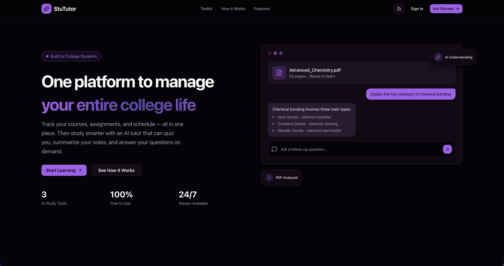

# StuTutor

A comprehensive college web application designed to help students manage their studies with AI-assisted tools.

## 🎯 Project Goal

StuTutor is a centralized platform for college students to organize and manage all aspects of their academic life. With built-in AI capabilities, students can get intelligent assistance with their coursework, making studying more efficient and productive.

## Key Features

### Dashboard
Central hub for managing your academic activities and getting an overview of your college life.

### Courses
Organize and track all your enrolled courses in one place.

### Assignments
Manage your assignments, track deadlines, and stay on top of your coursework.

### Calendar
Keep track of important dates, classes, and academic events.

### AI Tutor
AI-powered assistant that can read and analyze documents (PDFs, textbooks, lecture notes) and provide intelligent responses based on the content. Upload your study materials and get instant help with understanding concepts, answering questions, and more.

**Note:** More AI features are coming soon to further enhance your learning experience!
