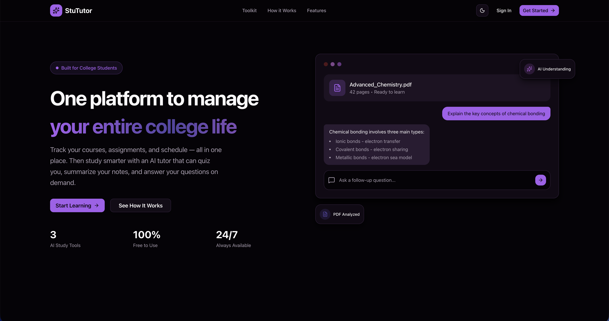

# StuTutor

A comprehensive college web application designed to help students manage their studies with AI-assisted tools.

## 🎯 Project Goal

StuTutor is a centralized platform for college students to organize and manage all aspects of their academic life. With built-in AI capabilities, students can get intelligent assistance with their coursework, making studying more efficient and productive.

## Key Features

### Dashboard
Central hub for managing your academic activities and getting an overview of your college life.

### Courses
Organize and track all your enrolled courses in one place.

### Assignments
Manage your assignments, track deadlines, and stay on top of your coursework.

### Calendar
Keep track of important dates, classes, and academic events.

### My Notes
Where users' generated notes are stored while using the A.I Study Notes Summarizer. The notes are saved based on the course the user chooses.

### AI Tutor
AI-powered assistant with multiple tools to enhance your learning experience:

#### 1. Study Notes Summarizer
- Input a topic or upload a PDF document
- AI generates comprehensive study notes including:
  - Title of the topic
  - Summary
  - Key Concepts
  - Important Terms
  - Practice Questions

#### 2. Quiz Generator
- Input a topic or upload a PDF document
- AI generates quiz questions from both topic-based content and uploaded PDFs
- Test your knowledge and reinforce learning

#### 3. AI Chat Tutor
- Upload a PDF document
- Ask Q&A questions about the document content
- Get instant, accurate answers based on your study materials

## Tech Stack

### Frontend
- **Next.js** - React framework with App Router, server-side rendering, and API routes
- **React** - UI library
- **TypeScript** - Type-safe JavaScript
- **Tailwind CSS** - Utility-first CSS framework
- **shadcn/ui** - Component library built on Radix UI primitives
- **Framer Motion** - Animation library
- **React Hook Form** + **Zod** - Form handling and schema validation
- **TanStack React Table** - Headless table library
- **Recharts** - Chart and data visualization
- **React Markdown** - Markdown rendering
- **jsPDF** + **React PDF** - PDF generation and viewing
- **Lucide React** + **Tabler Icons** - Icon sets
- **Sonner** - Toast notifications
- **next-themes** - Dark mode support

### Backend & Database
- **Supabase** - Backend-as-a-Service providing PostgreSQL database, authentication, and file storage
- **PostgreSQL** - Relational database (hosted via Supabase)

### Authentication
- **Supabase Auth** - Email/password and OAuth authentication
- **Google OAuth 2.0** - Social login
- **Row Level Security (RLS)** - Database-level access control

### AI
- **Google Gemini** (via `@google/genai`) - AI model powering the Study Notes Summarizer, Quiz Generator, and AI Chat Tutor
